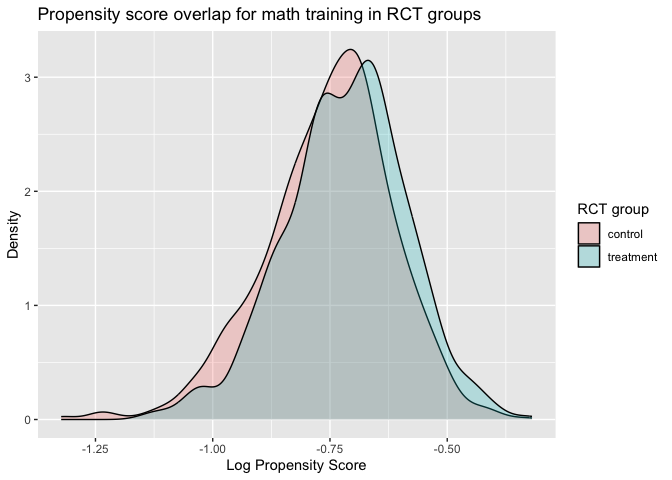

<!-- README.md is generated from README.Rmd. Please edit that file -->

**NOTE: This is a package is under construction.**

# WSCdata

<!-- badges: start -->
<!-- badges: end -->

The goal of WSCdata is to make a within-study comparison design data for
evaluating non-experimental methods publicly available. We aim to
improve access to high-quality within-study comparison data for applied
methodological research.

## Installation

To install the latest version of WSCdata from CRAN with:

``` r
install.packages("WSCdata")
```

To install the development version of WSCdata from
[GitHub](https://github.com/) with:

``` r
# install.packages("devtools")
devtools::install_github("jzangela/WSCdata")
```

## Usage

The study aimed to examine the impact of a mathematics training
intervention and a vocabulary study session on posttest scores in
mathematics and vocabulary, respectively. The dataset `WSCdata` provides
baseline measures on general self-efficacy, mathematics confidence,
demographic questions, pretest measures, selection, random assignment,
and posttest measures. We provide item-level data for the pre- and
post-tests of the mathematics and vocabulary interventions in the
datasets `Math_Pre_WSC`, `Math_Post_WSC`, `Vocab_Pre_WSC`, and
`Vocab_Post_WSC`. Additionally, item responses recorded during
mathematics training sessions are available for participants who
received the mathematics intervention in the dataset `Math_Train_WSC`.
Responses to non-cognitive items were also available in their own
dataset. `AMAS_WSC` contains item-wise measurement data from a nine-item
Abbreviated Mathematics Anxiety Scale (Hopko et al., 2003) that assesses
mathematics anxiety. `BDI_WSC` includes item-wise measurement data from
a thirteen-item Beck Depression Inventory (Beck et al., 1996) that
measures symptoms of depression. `Big5_WSC` offers item-wise measurement
data from the Big Five Personality Inventory (John & Srivastava, 1999)
that assesses personality on five dimensions: openness to experience,
conscientiousness, extraversion, agreeableness, and neuroticism.
`GSES_WSC` provides item-wise measurement data from the General
Self-Efficacy Scale (Schwarzer & Jerusalem, 1995) that measures the
degree to which participants believe in their ability to cope with
unexpected or difficult situations. `MSC_WSC` contains
researcher-created measures on confidence in understanding of, and
ability to simplify, algebraic expressions involving exponents.

Below is an example of analysis based on `WSCdata` for estimating
intervention effect.

``` r
if (requireNamespace("tidyverse", quietly = TRUE)) {
  library(WSCdata)
  library(tidyverse)

  # Load WSCdata
  data("WSCdata", package = "WSCdata")
}
```

We first specified a list of baseline covariates in `cov_nms` for future
adjustments or propensity score modeling.

``` r
# A list of covariates that will be used for further adjustment
cov_nms <- c(
  "female", "white", "black", "asian", "hisp",
  "married", "logAge", "income",
  "collegeS", "collegeM", "collegeD",
  "calc", "logBooks", "mathLike",
  "big5O", "big5C", "big5E", "big5A", "big5N",
  "AMAS", "logBDI", "MCS", "GSES",
  "vocabPre", "mathPre"
)
```

Here is an example of average treatment effect (ATE) estimation based on
random assignment. To study the impact of a mathematics training
intervention, we can use difference in mean estimation method, as shown
in the following analysis

``` r
fmla_unadj_ate_math <- as.formula(paste("mathPost ~ mathGrp"))
summary(lm(fmla_unadj_ate_math, data = WSCdata))
#> 
#> Call:
#> lm(formula = fmla_unadj_ate_math, data = WSCdata)
#> 
#> Residuals:
#>     Min      1Q  Median      3Q     Max 
#> -9.3299 -2.5695 -0.3299  2.6701  6.4305 
#> 
#> Coefficients:
#>             Estimate Std. Error t value Pr(>|t|)    
#> (Intercept)   8.5695     0.1051   81.52  < 2e-16 ***
#> mathGrp       0.7603     0.1512    5.03  5.3e-07 ***
#> ---
#> Signif. codes:  0 '***' 0.001 '**' 0.01 '*' 0.05 '.' 0.1 ' ' 1
#> 
#> Residual standard error: 3.543 on 2198 degrees of freedom
#> Multiple R-squared:  0.01138,    Adjusted R-squared:  0.01093 
#> F-statistic:  25.3 on 1 and 2198 DF,  p-value: 5.302e-07
```

The results show that the difference-in-means estimators for the ATE
estimand for the effects of mathematics intervention on its posttests is
0.76 (SE: 0.15). This indicates that the average treatment effect (ATE)
of mathematics training on math test scores is 0.76.

We can further adjust for baseline covariates specified in `cov_nms` in
the estimation

``` r
fmla_ancova_ate_math <-
  as.formula(paste("mathPost ~ mathGrp + ", paste(cov_nms, collapse = " + ")))
summary(lm(fmla_ancova_ate_math, data = WSCdata))
#> 
#> Call:
#> lm(formula = fmla_ancova_ate_math, data = WSCdata)
#> 
#> Residuals:
#>     Min      1Q  Median      3Q     Max 
#> -9.2772 -1.3605  0.0836  1.4372  6.9177 
#> 
#> Coefficients:
#>              Estimate Std. Error t value Pr(>|t|)    
#> (Intercept)  4.160199   1.034178   4.023 5.95e-05 ***
#> mathGrp      0.780127   0.088821   8.783  < 2e-16 ***
#> female      -0.072388   0.097467  -0.743 0.457744    
#> white        0.010217   0.196198   0.052 0.958475    
#> black        0.208908   0.213851   0.977 0.328736    
#> asian        0.631226   0.238121   2.651 0.008087 ** 
#> hisp         0.308496   0.194260   1.588 0.112419    
#> married     -0.096093   0.099671  -0.964 0.335103    
#> logAge      -0.955883   0.177121  -5.397 7.52e-08 ***
#> income      -0.087611   0.104823  -0.836 0.403359    
#> collegeS     0.479408   0.103322   4.640 3.69e-06 ***
#> collegeM    -0.086150   0.115155  -0.748 0.454466    
#> collegeD     0.147552   0.111354   1.325 0.185286    
#> calc         0.330209   0.103806   3.181 0.001488 ** 
#> logBooks    -0.102013   0.045430  -2.245 0.024836 *  
#> mathLike     0.338877   0.109882   3.084 0.002068 ** 
#> big5O        0.004178   0.007197   0.581 0.561597    
#> big5C       -0.004523   0.008700  -0.520 0.603154    
#> big5E        0.024344   0.006940   3.508 0.000461 ***
#> big5A       -0.007329   0.007966  -0.920 0.357630    
#> big5N       -0.006886   0.009244  -0.745 0.456401    
#> AMAS        -0.028104   0.006369  -4.413 1.07e-05 ***
#> logBDI       0.036218   0.183488   0.197 0.843543    
#> MCS          0.123272   0.010466  11.778  < 2e-16 ***
#> GSES        -0.011559   0.017052  -0.678 0.497899    
#> vocabPre     0.080059   0.012282   6.519 8.79e-11 ***
#> mathPre      0.653601   0.018513  35.305  < 2e-16 ***
#> ---
#> Signif. codes:  0 '***' 0.001 '**' 0.01 '*' 0.05 '.' 0.1 ' ' 1
#> 
#> Residual standard error: 2.065 on 2173 degrees of freedom
#> Multiple R-squared:  0.668,  Adjusted R-squared:  0.6641 
#> F-statistic: 168.2 on 26 and 2173 DF,  p-value: < 2.2e-16
```

Holding constant the baseline covariates via Analysis of Covariates, the
ATE estimate is 0.78 (SE: 0.09).

To show the overlap of the propensity in being randomly assigned to the
treatment group, we can visualize it using overlap density plot

``` r
# Define the formula for the propensity score model for math training propensity
fmla_ps_math <-
  as.formula(paste("mathGrp ~ ", paste(cov_nms, collapse = " + ")))

# Fit a logistic regression model to predict propensity scores
ps_math <- predict(glm(
  formula = fmla_ps_math,
  family = "binomial",
  data = WSCdata
), type = "response")

# Merge propensity scores to the original dataset
lps_grp_math <- data.frame(cbind(lps = log(ps_math), mathGrp = WSCdata$mathGrp))

# Create an overlap density plot based on log transformed propensity scores for treatment and control group
lps_grp_math |>
  mutate(mathGrp_fct = case_when(mathGrp == 1 ~ "treatment",
                                 mathGrp == 0 ~ "control")) |>
  ggplot(aes(x = lps, fill = mathGrp_fct)) + geom_density(alpha = 0.25) +
  xlab("Log Propensity Score") +
  ylab("Density") +
  ggtitle("Propensity score overlap for math training in RCT groups") +
  guides(fill=guide_legend(title="RCT group"))
```

 The
plot shows overlap of the density across propensity for treatment and
control group, indicating that the randomization is successful and there
is baseline balance between treatment groups.

ATE estimates for the vocabulary training can be studied in the same
fashion, with changing the group indicator based on vocabulary training
status, which is the opposite of math training status.

Other estimators such as ATT and ATU can be studied with group
indicators generated from the combination of randomization and
self-selection indicator.

For more information about the four-arm WSC design and analysis, please
check out Keller et al. (2022).

# References

<div id="refs" class="references csl-bib-body hanging-indent"
entry-spacing="0">

<div id="ref-keller_2022_" class="csl-entry">

Keller, Bryan, Vivian Wong, Sangbaek Park, Jingru Zhang, Sheehan
Patrick, and Steiner Peter. 2022. “Experimental and Quasi-Experimental
Identification of Conditional Average Treatment Effects: A Four-Arm
Within-Study Comparison.” Open Science Foundation.
[osf.io/e3mpf](https://osf.io/e3mpf).

</div>

</div>
